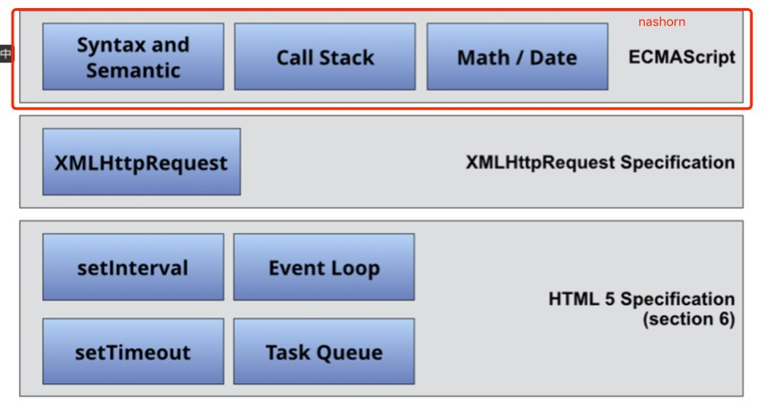

# This is Moqui React SSR (Server-Side Rendering) Add-On Component 

This [Moqui](https://github.com/moqui/moqui-framework) add-on component adds support of [React](facebook.github.io/react) Server Rendering capability to Moqui. 

You may try the [demo](https://github.com/shendepu/moqui-react-ssr-demo)

# Desgin 

- Use Nashorn rendering react app in JVM
- Support multiple apps, each app should have a unique name. 
- Each app use one Nashorn Engine to render all requests
- Support multi-threads of rendering with isolated global bindings. 

# Requirement for React App

The react app should support server-side rendering. and app should not pollute Javascript global.

## Javascript Polyfills for Nashorn

Nashorn only implements EMACScript, but client-side javascript app may use Browser capability 

This component has already added polyfills for XMLHttpRequest (Not complete version, but can work with fetch) and HTML 5 Specification (Section 6)

The client-side javascript app would need to polyfill `promise` and `fetch` on global if it used them. 
 
## Variables 

- `__APP_BASE_PATH__`: defines the react app base path. In some cases, base path might not be `/`, so react router should prepend `__APP_BASE_PATH__` in root route.
- `__IS_SSR__`: when rendered in nashorn, `__IS_SSR__ = true` is injected in global, so react app could use `window.__IS_SSR__` to tell it is rendered on server
- `__REQ_URL__`: the request Url injected in global, it is the HttpServletRequest URI except protocol, domain and port part. React router should use it for SSR route logic.      

## Result of Render
Result is a map with two keys 

- `html`: server render string of html 
- `state`: redux store state rendered by server

The index.html should be rendered on server with use of `html` and `state` to accomplish server side rendering.

## Boilerplate of SSR App  

### React Redux Starter Kit
You may use customized version of [React Redux Starter Kit](https://github.com/shendepu/react-redux-starter-kit/tree/moqui-react-ssr) which add SSR support.
 
### Although this component name contains React, it may be used by other single page app technologies like Angular JS, but only React app is tested.   

# To-do list

- Use [Apache Common Pool](https://commons.apache.org/proper/commons-pool/) to pool Nashorn ScriptContext bindings instead of creating one per render 

# Reference 

https://github.com/winterbe/spring-react-example 

# License

Moqui React SSR is [CC0-licensed](./LICENSE.md). we also provide an addition [copyright and patent grant](./AUTHORS) 